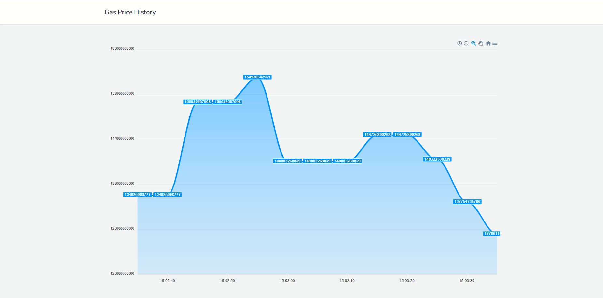

Laravel + soketi = <3
=====================



A small Laravel demo that polls the ETH gas price in real time with soketi.

## Installing the project

The server requires:

- Composer
- Node.js + NPM (for soketi)
- PHP 8.0+

```bash
git clone git@github.com:soketi/laravel-eth-history.git
```

```bash
cd laravel-eth-history
```

## Installing the chat room app

Run the following chain commands to install the project:

```bash
composer install --ignore-platform-reqs && \
cp .env.example .env && \
touch database/database.sqlite && \
php artisan key:generate && \
php artisan migrate:fresh --seed && \
php artisan storage:link
```

Open your `.env` file and configure your mainnet host (for the ETH API) and the `PUSHER_*` credentials (which can be the same as the default ones below):

```bash
WEB3_WS_HOST=wss://mainnet.infura.io/... # for example
WEB3_HTTP_HOST=https://mainnet.infura.io/... # for example

PUSHER_APP_KEY=app-key
PUSHER_APP_ID=app-id
PUSHER_APP_SECRET=app-secret
PUSHER_HOST=127.0.0.1
PUSHER_PORT=6001

MIX_PUSHER_APP_KEY="${PUSHER_APP_KEY}"
MIX_PUSHER_HOST="${PUSHER_HOST}"
MIX_PUSHER_PORT="${PUSHER_PORT}"
```

Build the frontend assets:

```bash
npm install && npm run dev
```

Run the internal server to make the HTTP server accessible on `http://127.0.0.1:8000`:

```bash
php artisan serve
```

## Polling ETH gas prices

If you correctly configured the `WEB3_WS_HOST` variable, running `eth:poll:gas` will pick the gas price and stream it to the frontend.

```bash
$ php artisan eth:poll:gas --interval=5 --verbose
```

## Installing soketi

You can find multiple [installation methods](https://rennokki.gitbook.io/soketi-docs/getting-started/installation) for soketi, but for this project we assume you already have NPM installed:

```bash
npm install -g @soketi/soketi@latest
```

To launch the server, open a new terminal window and let it run in the background:

```bash
soketi start
```

## Linting the code

You can lint the code for Vue:

```bash
npm run lint
```

For PHP, use the CSFixer command:

```bash
vendor/bin/php-cs-fixer fix
```
